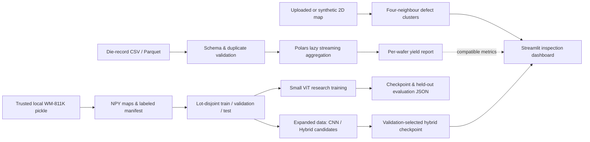
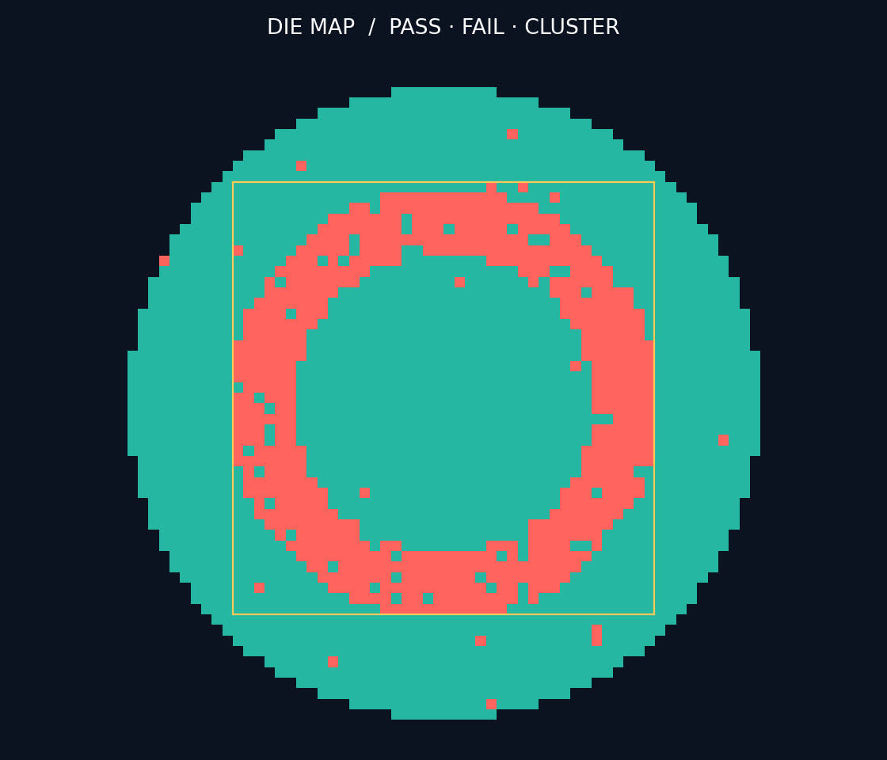

# WaferInsight-AI
### Semiconductor Wafer Defect Patterns & Yield Analytics Pipeline

> A reproducible engineering portfolio combining **Polars streaming analytics**, **spatial defect clustering**, and a trained **convolutional-stem Transformer** for wafer-map pattern research.


## Executive Summary

WaferInsight-AI converts die-level wafer maps into yield summaries, spatial cluster boxes, and downloadable inspection reports. It includes a small PyTorch ViT and a lot-disjoint training/evaluation workflow for WM-811K-compatible maps.

**Status: working research/portfolio prototype, not production-qualified fab software.** The improved model trains on 13,933 real WM-811K maps and achieves **93.28% on the historical nine-class test** and **92.24% on a new seven-class audit from unused lots**. A verified, CPU-loadable checkpoint is included. Raw data is not distributed in Git. The demo uses synthetic maps unless a user uploads a map.

**[Model improvement report and runnable weights](reports/improvement/README.md)** — validation-only selection, 18 passing local tests, per-class metrics, audit limitations and reproducible training.

**[Read the public-data experiment](reports/wm811k/README.md)** — source checksum, exact split manifest, actual examples, classification metrics, confusion matrices and real-record ETL timings.

Wafer maps encode die test outcomes; they are not optical micrographs. Failed-die connected components are not microscopic defect segmentation. AOI image detection, chamber root-cause attribution, HBM process integration, multi-agent diagnosis, ONNX and edge deployment remain future work.

## System Architecture



## Key Technical Features

- **Polars ETL:** lazy CSV/Parquet scanning, streaming yield aggregation, validation for invalid status, missing values and duplicate die coordinates.
- **Spatial inspection:** four-neighbour connected components and bounding boxes in die coordinates, with configurable yield alert thresholds.
- **ViT research workflow:** 64×64 categorical map preprocessing, 8×8 patch embedding, two Transformer encoder layers and nine-class output; trained from scratch.
- **Improved classifier:** convolutional stem, spatial Transformer, balanced sampling, augmentation and cosine scheduling; validation-selected and packaged for CPU inference.
- **Evaluation discipline:** disjoint lots, validation-based checkpoint selection, held-out test accuracy, macro-F1, class support and confusion matrix.
- **Interactive dashboard:** JSON/CSV map upload, synthetic pattern exploration, metrics, cluster overlay, CSV/JSON export.
- **Engineering packaging:** meaningful automated tests, GitHub Actions and a non-root Docker demo.

## Quick Start

```bash
git clone https://github.com/burtshann/WaferInsight-AI.git
cd WaferInsight-AI
python -m venv .venv
# Windows: .venv\Scripts\activate
# macOS/Linux: source .venv/bin/activate
pip install -r requirements.txt
streamlit run app.py
```

The demo runs without downloading WM-811K or any model weights. Upload a rectangular JSON array or headerless CSV with **0 = outside wafer, 1 = pass, 2 = fail** (2–512 rows/columns).

For trained predictions, install `requirements-ml.txt`, then enable **Run trained wafer-pattern classifier** in the dashboard. The weights are included in `models/`. Alternatively run `python scripts/predict_wafer.py path/to/wafer.json`.

```bash
python scripts/benchmark_polars_etl.py --rows 1000000 --repeats 5
python -m pytest -q
docker build -t waferinsight .
docker run --rm -p 8501:8501 waferinsight
```

## Benchmark & Performance

See [raw benchmark results](reports/benchmark.json) for actual measurements, environment, timings and input SHA-256. The script verifies equal outputs and alternates execution order. Its timing includes CSV reading, status filtering, yield aggregation and sorting, after warm-up; validation and data generation are excluded. This is a warm-cache local benchmark, not a sustained fab ingest or an out-of-core memory benchmark.

| Claim | Evidence / status |
| :--- | :--- |
| Polars vs Pandas throughput | 28.82M rows/s; 9.02× median ratio on 1M synthetic rows, local warm-cache run |
| WM-811K real-record ETL | 1,864,924 records from 1,000 real wafers; 28.86M rows/s; 13.23× median ratio, local warm cache |
| Small ViT, WM-811K subset | 65.89% test accuracy / 0.691 macro-F1, RTX 4050, 10 epochs |
| Spatial Random Forest, same subset | 73.51% test accuracy / 0.757 macro-F1 |
| Improved hybrid, same historical nine-class test | **93.28% accuracy / 0.9398 macro-F1**; expanded training data |
| Improved hybrid, new seven-class audit | **92.24% accuracy / 0.9219 supported-class macro-F1**; 1,082 maps, 667 unused lots |
| AOI mAP / segmentation IoU | Not applicable to this wafer-map implementation |
| GPU / edge inference latency | Not measured |

The public classification experiment uses 2,503 training, 809 validation and 774 test maps, with no shared lots or exact duplicate maps across partitions. It is a capped subset with altered class priors, not the official split or full-dataset performance. The Random Forest baseline outperformed the small ViT in this run. [Raw results and protocol](reports/wm811k/README.md).

The improvement experiment increases training to 13,933 maps while preserving validation and historical-test membership. The new audit excludes all previously used lots but lacks Donut and Near-full; it is **not independent nine-class validation**. See [the full comparison](reports/improvement/README.md); architecture, data quantity and optimization changed together.

The original template's 96.8% accuracy, 94.2% mAP and <12 ms latency are **not asserted**. Throughput numbers above are local measured workloads, not fab production guarantees.

For your own normalized CSV:

```bash
python scripts/benchmark_polars_etl.py --dataset WM811K --input data/die_records.csv
```

This command requires a real CSV; the dataset label never silently substitutes synthetic data. Required columns: `lot_id,wafer_id,x,y,status`; each coordinate must be unique within its lot/wafer. Aggregate yield is good valid dies divided by all valid dies, excluding status 0.

## Train the ViT

Obtain WM-811K separately and check its usage terms. Dataset redistribution is not covered by this repository's MIT license. The converter reads only a trusted local pickle (pickle can execute code). Unlabeled wafers are excluded rather than relabeled as healthy.

```bash
pip install -r requirements-ml.txt
python scripts/convert_wm811k.py data/LSWMD.pkl --trust-pickle
python scripts/export_records.py --manifest data/wm811k/manifest.csv
python scripts/train_vit.py --manifest data/wm811k/manifest.csv --epochs 10
```

Alternatively provide a CSV manifest with `map_path,label,lot_id`, paths relative to the manifest directory, and `.npy` maps using the same 0/1/2 encoding. Labels: `none, Center, Donut, Edge-Loc, Edge-Ring, Loc, Random, Scratch, Near-full`.

The deterministic seed-42 split reserves approximately 15% of lots each for validation and testing. It does not reproduce the official split. Inspect support counts: rare classes may be absent; macro-F1 uses all nine classes with undefined F1 set to zero. Training supports `--device auto|cpu|cuda`. The original model is trained from scratch; the dashboard's optional classifier uses the separately packaged improved hybrid.

To reproduce the **published public-data subset**, use the download, deduplication and preparation commands in [the study](reports/wm811k/README.md). Its manifest contains predefined splits; training validates lot separation and uses those splits directly. That workflow adds exact-content deduplication and a spatial Random Forest baseline. Multi-seed and full-dataset studies remain future work.

## Preview


*Actual public held-out examples with original source row IDs. These are not synthetic images.*



*Generated from the actual map generator and clustering code. Synthetic Donut pattern; teal = passing die, red = failing die, amber = component bounding box. This is an exported inspection plot, not a claimed screenshot of a deployed fab system.*

## Project Layout

```text
app.py                         Interactive inspector
waferinsight/core.py            Validation, generation, aggregation, clustering
waferinsight/model.py           Trainable small ViT
scripts/benchmark_polars_etl.py Reproducible Polars/Pandas comparison
scripts/convert_wm811k.py       Trusted local dataset conversion
scripts/train_vit.py            Lot split, training, evaluation
tests/                         Analytics, model and app tests
reports/                       Measured evidence
```

## Limitations & Next Steps

Validation performs additional scans and duplicate grouping; its memory use is not guaranteed bounded. The UI handles a single wafer map; large record batches are processed with the Python API/benchmark. Alerts are deterministic threshold checks and do not diagnose equipment causality. No production access control, MES integration, drift monitoring or reliability qualification is included. Docker configuration and CI are supplied; consult [validation notes](reports/validation.md) for what was actually executed.

## References & License

- Wu, M.-J., Jang, J.-S. R., and Chen, J.-L. (2015), *Wafer Map Failure Pattern Recognition and Similarity Ranking for Large-Scale Data Sets*, IEEE Transactions on Semiconductor Manufacturing 28(1), 1–12. [DOI](https://doi.org/10.1109/TSM.2014.2364237).
- [WM-811K dataset listing](https://www.kaggle.com/datasets/qingyi/wm811k-wafer-map)
- [Polars streaming documentation](https://docs.pola.rs/user-guide/concepts/streaming/)

Code is distributed under the [MIT License](LICENSE). Synthetic examples are generated by this project.

---

**中文说明：** 改进模型已在 RTX 4050 上用 13,933 张真实晶圆图完成训练，历史九类测试准确率从 65.89% 提升到 93.28%；新批次七类检查集准确率为 92.24%。权重和界面预测入口已提供。新检查集缺少 Donut、Near-full，结果不代表全量数据集或工业产线性能。
