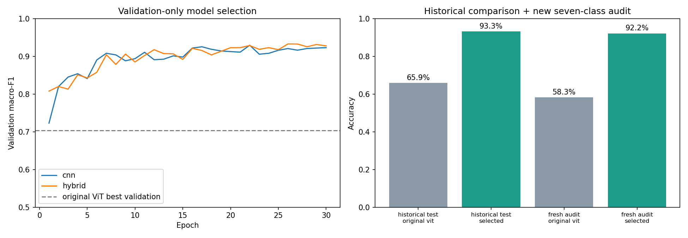
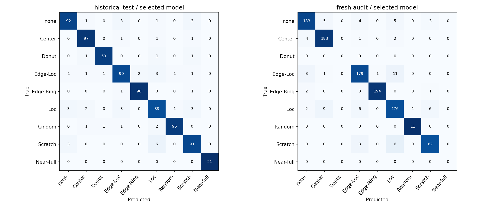

# Model improvement: convolutional-stem Transformer

The selected model improves historical nine-class test accuracy from **65.89% to 93.28%**, and achieves **92.24%** on a new audit drawn from previously unused lots. These evaluations have different coverage.



## What changed

- Expanded training from 2,503 to **13,933 real WM-811K maps**, keeping the original complete training-lot allocation. Caps: 4,000 none, 2,000 per other class; available rare-class examples retained below those caps.
- Replaced direct patch embedding with three convolutional stages (32/64/96 channels), each with two 3×3 convolutions, BatchNorm and GELU. The hybrid adds two 96-dimensional Transformer layers over 64 spatial tokens and a 4×4 spatial pooling head. **656,937 parameters**, trained from scratch.
- Added training-only quarter-turn rotations/flips, inverse-frequency sampling, label smoothing 0.05, AdamW lr 0.001/weight decay 0.01, cosine decay to 0.00001 and gradient clipping 1.0. Both candidates used 30 epochs, batch 128 and seed 42 on RTX 4050.
- Selected checkpoint and architecture using the original **809-map validation set only**. CNN best validation macro-F1 was 0.9296 (epoch 22); hybrid was 0.9330 (epoch 26). This small difference does not establish a general Transformer advantage.

Data volume, optimization and architecture changed together: this is a combined improvement, not an architecture-only ablation. No pretraining, synthetic training examples, test-time augmentation or post-test tuning was used. [Protocol fixed before training](protocol.md).

## Results

| Evaluation | Original ViT accuracy / macro-F1 | Selected hybrid accuracy / macro-F1 |
| --- | ---: | ---: |
| Historical test: 774 maps, nine classes | 65.89% / 0.6911 | **93.28% / 0.9398** |
| New audit: 1,082 maps, seven supported classes | 58.32% / 0.6299 | **92.24% / 0.9219** |

Macro-F1 in this table averages classes with true support. Raw JSON also reports all-nine-class macro-F1 with absent-class F1 set to zero. The seven-class score is not a nine-class score.

The new audit includes **667 lots**, excludes every lot used in the previous 4,086-map experiment, and shares neither lots nor exact original maps with current training/validation. Support: none/Center/Edge-Loc/Edge-Ring/Loc 200 each, Scratch 71, Random 11. **Donut and Near-full are absent**: no untouched examples in the eligible original test-lot pool remained after excluding previously used lots. Independent evidence for those classes needs new data. Caps change priors; rare-class support is limited.

The original 774-map test had already been inspected; its score is historical comparison. On that set, none recall improves from 39% to 92%, Loc from 36% to 88%, and Scratch from 63% to 91%.

On the new audit, paired accuracy gain is **33.92 percentage points**. A paired lot-cluster bootstrap (2,000 resamples, seed 42) gives a 95% percentile interval of **30.00–38.08 points**. This estimates sampling uncertainty conditional on this audit, not model-seed variability, domain shift or missing classes. [Evidence](uncertainty.json).



## Evidence

- [dataset_audit.json](dataset_audit.json): source checksum, coverage, split counts and cache hash.
- [split_manifest.csv](split_manifest.csv): source row, label, lot, content hash and partition.
- [cnn_validation.json](cnn_validation.json) / [hybrid_validation.json](hybrid_validation.json): every epoch, runtime and checkpoint hashes.
- [selection.json](selection.json): validation-only decision, written before final audit inference.
- [final_evaluation.json](final_evaluation.json): per-class precision/recall/F1, support and matrices for both models.
- [predictions.csv](predictions.csv): individual source-row predictions.

Runs used Python 3.11.13, PyTorch 2.5.1/CUDA 11.8 and RTX 4050 Laptop GPU (6 GB). CNN training/validation took 51.58 seconds; hybrid 71.35 seconds. These are training timings, not inference latency. One training seed per architecture was evaluated.

## Run the packaged model

The selected **2.65 MB state_dict** is in [models/wafer_inspector.pt](../../models/wafer_inspector.pt), with [a model card](../../models/model_card.json). Loading verifies SHA-256 and uses `weights_only=True`. CPU prediction requires no raw dataset download.

```bash
pip install -r requirements-ml.txt
python scripts/predict_wafer.py path/to/wafer.json
streamlit run app.py
```

Upload a JSON/headerless CSV map and enable **Run trained wafer-pattern classifier**. Inputs: 0 outside, 1 pass, 2 fail. Softmax scores are uncalibrated, not production release decisions.

## Reproduce

Use CUDA-enabled PyTorch; recorded version: 2.5.1/CUDA 11.8. General requirements target newer versions; cross-version results may differ. The commands use a separate report directory to preserve published evidence. Candidate training and final evaluation refuse to overwrite prior result files.

```bash
python scripts/download_wm811k.py
python scripts/prepare_public_benchmark.py --input data/raw/LSWMD.pkl --trust-pickle
# Recreate original baseline if its checkpoint is unavailable:
python scripts/train_vit.py --manifest data/wm811k-public/manifest.csv --device cuda --epochs 10 --batch-size 64 --output checkpoints/wm811k
python scripts/prepare_improvement.py --input data/raw/LSWMD.pkl --trust-pickle --report reports/reproduction
python scripts/improve_model.py train --architecture cnn --reports reports/reproduction --output checkpoints/reproduction
python scripts/improve_model.py train --architecture hybrid --reports reports/reproduction --output checkpoints/reproduction
python scripts/improve_model.py evaluate --reports reports/reproduction --output checkpoints/reproduction
python scripts/summarize_improvement.py --reports reports/reproduction --checkpoints checkpoints/reproduction --model-dir checkpoints/reproduction/package
```

Full pickle loading is memory intensive; source bytes are SHA-256 checked before deserialization. This remains wafer-map research, not microscopic AOI or production qualification. Near-duplicate correlations, multi-seed stability, naturally distributed full-data evaluation and external-fab validation remain open.
