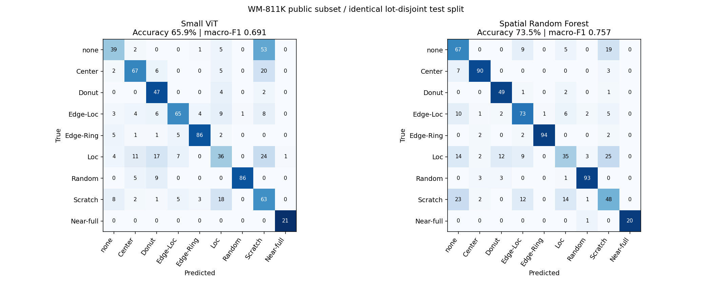
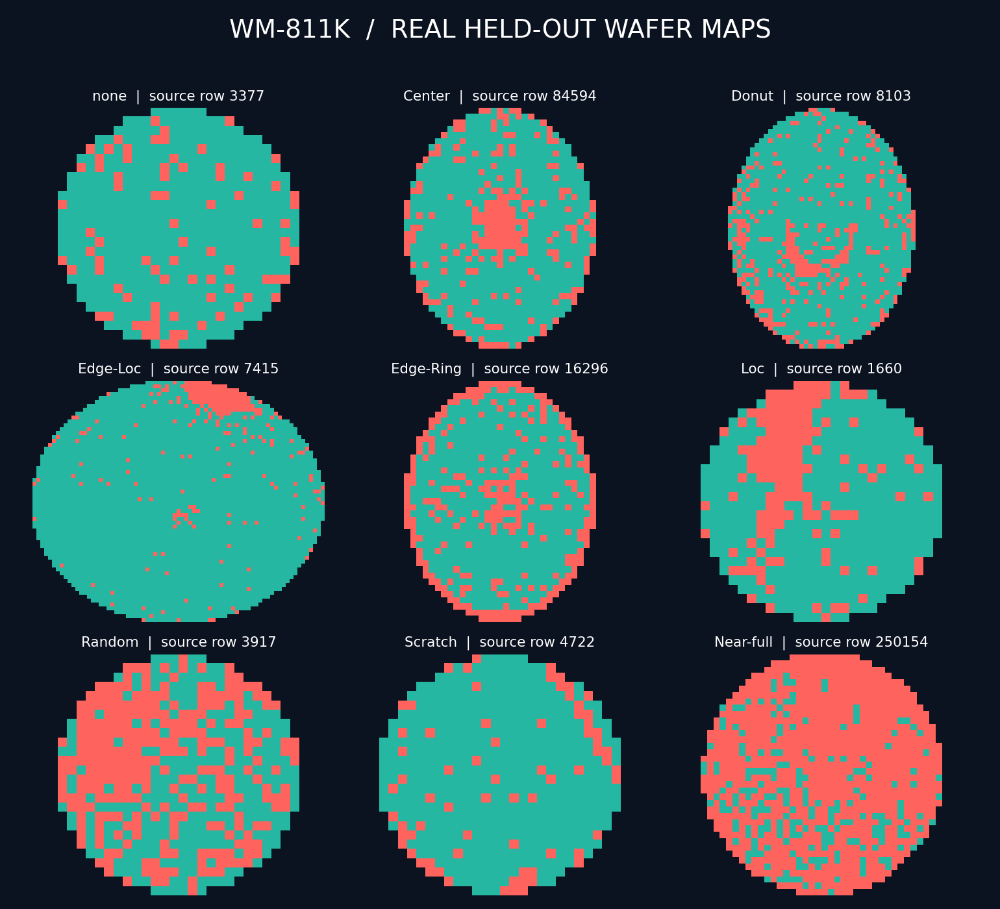

# WM-811K public-data study

This study replaces synthetic-only evidence with an actual public semiconductor wafer-map experiment. The raw source is [QINGYI's WM-811K listing](https://www.kaggle.com/datasets/qingyi/wm811k-wafer-map), which cites Wu, Jang and Chen, IEEE TSM (2015), and lists CC0. These are die-test maps, not optical inspection micrographs.

## Source and audit

- Raw file: `LSWMD.pkl`, 2,095,505,977 bytes.
- SHA-256: `1d04fccb3dd3176b276878b926b20fead7e077c5751e4d353ea9741a5e7b5c65`.
- Observed: 811,457 wafers, 46,293 unique lot names, 172,950 labeled maps and 638,507 unlabeled maps. The measured lot count is reported directly; it differs from the 46,393 mentioned on the dataset card.
- Healthy/no-pattern label `none` is distinct from unlabeled. It can still contain isolated failing dies.
- After removing conflicting labels for identical maps and retaining only the first of other exact duplicates: 169,684 unique labeled maps. 3,266 rows removed, including 28 rows with conflicting labels.

See [dataset_audit.json](dataset_audit.json) for the complete class counts and source checksum. No synthetic maps or augmentation are included in this experiment.

## Evaluation protocol

We deduplicated exact original map content (shape plus 0/1/2 bytes) before splitting. Unique lots were shuffled with seed 42 and divided approximately 70/15/15. Sampling caps were applied independently within each split: at most 300 maps per class for training and 100 per class for validation/testing. Rare classes retain all available maps up to the cap.

| Partition | Maps | Distinct lots |
| --- | ---: | ---: |
| Training | 2,503 | 1,852 |
| Validation | 809 | 551 |
| Test | 774 | 526 |
| Total | 4,086 | 2,929 |

All nine labels appear in each partition. Test support is 100 per class except Donut (53) and Near-full (21). [split_manifest.csv](split_manifest.csv) preserves source row, label, lot, split, relative map path and content hash for every selected map.

**This is a capped research subset, not full WM-811K accuracy or the official dataset split.** Class priors have been changed by sampling. Exact deduplication and lot separation reduce specific leakage risks but do not prove absence of near-duplicate/process correlations. Scores should only be compared on this exact split. No test-driven tuning or test-time augmentation was used.

## Reproduce

```bash
pip install -r requirements-research.txt
python scripts/download_wm811k.py
python scripts/prepare_public_benchmark.py --input data/raw/LSWMD.pkl --trust-pickle
python scripts/benchmark_polars_etl.py --dataset WM811K --input data/wm811k-public/die_records.csv --output reports/wm811k/etl_benchmark.json
python scripts/benchmark_classifier.py --manifest data/wm811k-public/manifest.csv
python scripts/train_vit.py --manifest data/wm811k-public/manifest.csv --device cuda --epochs 10 --batch-size 64 --output checkpoints/wm811k
```

Use an appropriate CUDA-enabled PyTorch installation for `--device cuda`, or explicitly select `--device cpu`. Full source loading is memory intensive (over 3 GB process memory was observed). Source data and checkpoints are kept out of Git; download and regenerate maps from the checksummed source. The pickle is deserialized only after the explicit trusted-source flag.

The local GPU run uses the existing NVIDIA GeForce RTX 4050 Laptop GPU (6 GB), driver 592.82, PyTorch 2.5.1 and CUDA runtime 11.8 in Python 3.11.13. Driver-reported CUDA 13.1 is the driver's supported version, not the PyTorch runtime. The initial analytics environment had PyTorch 2.8.0+cpu; it did not reflect the hardware's GPU capability.

## Real ETL workload

The first 1,000 selected source rows, preserving original dimensions and valid-die coordinates, produced 1,864,924 records. Polars and Pandas outputs matched. The final warm-cache five-repeat comparison recorded Polars median 64.61 ms, Pandas median 854.56 ms, 28.86M records/s and a 13.23× median ratio. See [etl_benchmark.json](etl_benchmark.json). Dataset loading, validation, conversion and generation are excluded from timing; this is not a sustained fab ingest guarantee.

## Classification results

| Model | Test accuracy | Macro-F1 (all 9 classes) |
| --- | ---: | ---: |
| Majority class from training | 12.92% | — |
| Spatial Random Forest, 200 trees | 73.51% | 0.7567 |
| Small ViT, 10 epochs, validation-selected checkpoint | 65.89% | 0.6911 |

The ViT trained from scratch with AdamW (learning rate 0.0003), batch size 64 and seed 42. The checkpoint with the highest validation macro-F1 was selected at epoch 9; the held-out test set was evaluated once after selection. Training plus validation and final evaluation took 32.11 seconds on the RTX 4050. This is total run time, not inference latency. See [vit_evaluation.json](vit_evaluation.json) for per-epoch validation, test confusion matrix, checkpoint checksum and device evidence.

The [Random Forest baseline](baseline.json) uses 87 spatial density features (global, radial, angular and 8×8 grid), balanced class weights and fixed hyperparameters. It outperformed the compact ViT in this study. We do not claim an architectural advantage for ViT. Scarce training samples, low-resolution categorical maps and no pretrained weights are practical limits; stronger models require a new preregistered experiment rather than tuning against these test results.



## Real examples



Each example is the first selected test row for its class; no visual cherry-picking. Colors: outside=dark, pass=teal, fail=red. Titles identify the original zero-based source row.
